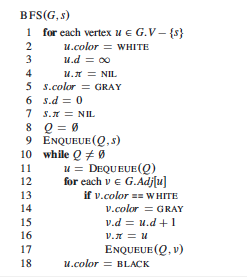

# Breadth-first search

## Usage

 - Breadth-first search is most often used when we want to find the shortest path in a graph with multiples vertex and edges. 
 - Unlike in Depth-first search, we want to check all the neighbours of a vertex/node before going further in the graph.
 - We often use a queue structure to implement the BFS, but remember that it uses more memory because it needs to stores the vertex/nodes pointers in memory.

## Pseudocode

## Example

Let say I have this graph and I want to know the shortest path from a specific node to another, the implementation here will do exactly this.

