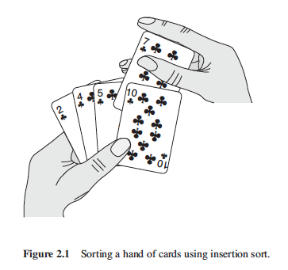

# Insertion sort

## Algorithm

Insertion sort works the way many people sort a hand of playing cards. We start with an empty left hand and a pile of cards on the table. Then we remove one card at a time from the pile and we insert it into the correct position in our left hand. So to find the correct position of a new card we compare it with each card already in our hand, from right to left, and we insert it into the right position, as the book illustrate it in this figure:

This algorithm is considered as a *Decrease by 1 and Conquer* algorithm.

##### Running time:

 - Worst case perfomance : O(n^2)
 - Best case perfomance : O(n)
 - Average case perfomance : O(n^2)
 - "Almost sorted" case perfomance : O(n)

##### Pros and cons:

 - The insertion sort is a fast in-place sorting algorithm for small input sizes.

## Pseudocode

This is the pseudcode you find in the book:

 

