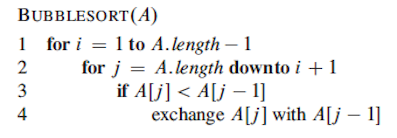

# Bubble sort

## Algorithm

Bubble sort algorithm works by iterating through each element of a list and comparing each element with the following one and
switching their positions if necessary so that the second one is the largest. At the first iteration the largest number will "bubble" to the end of the list and so on for the others iterations till all the numbers are sorted. When the largest value is positioned in the Nth position, the algorithm will only iterate through the (N-1)th position.

##### Running time:
  - Worst case performance       O(n^2)
  - Best case performance        O(n)
  - Average case performance     O(n^2)

##### When to use it :
- Use it when you have a small set to sort.
- Works well for an already sorted list.
- Works not so well for randomized or in reverse sort order list.

## Pseudocode
This is the pseudocode you find in the book :

 

