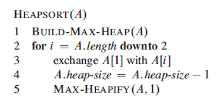
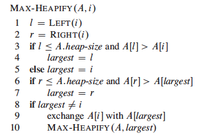

# Heap sort

## Algorithm

Heapsort algorithm use a data structure ("heap") to manage information. More specifically, we use max-heaps so the largest element is stored at the root. Here is a figure of a max-heap viewed as (a) a binary tree and (b) an array.

  
  
In the heapsort algorithm we call the procedure MAX-HEAPIFY, its input are an array A and an index i into the the array. The procedure assumes that the binary trees rooted at LEFT(i) and RIGHT(i) are max-heaps, but that A[i] might be smaller than its children, thus violating the max-heap property. You can find the MAX-HEAPIFY pseudocode below.
  
#### Running time :

  - Worst case perfomance : O(n log n)
  - Best case perfomance : O(n log n)
  - Average case perfomance : O(n log n)

#### Pros and cons:

- Heapsort combines the better attributes of the merge sort(running time is O(n lg n)) and of the insertion sort(sorts in place).

## Pseudocode

This is the pseudocode you find in the book:

 

