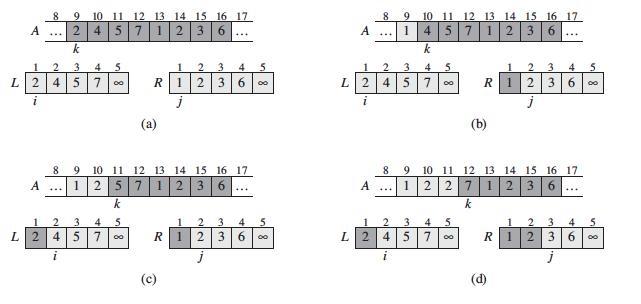
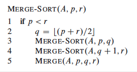
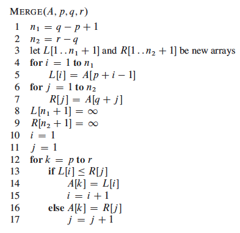

# Merge sort

## Algorithm

The merge sort algorithm is based on a divide and conquer paradigm. It starts vy dividing the n-element sequence to be sorted into 2 subsequence of n/2 elements each (Divide). After that it sorts the 2 subsequence recursively using merge sort (Conquer). Finally, it merges the 2 sorted subsequences to produce the sorted answer.

Here is image from the book that illustrate the merge algorithm:

##### Running time :
 - Worst case perfomance : O(n log n)
 - Best case perfomance : O(n log n)
 - Average case perfomance : O(n log n)

##### Pros and cons :

## Pseudocode

This is the pseudocode you find in the book :

 

